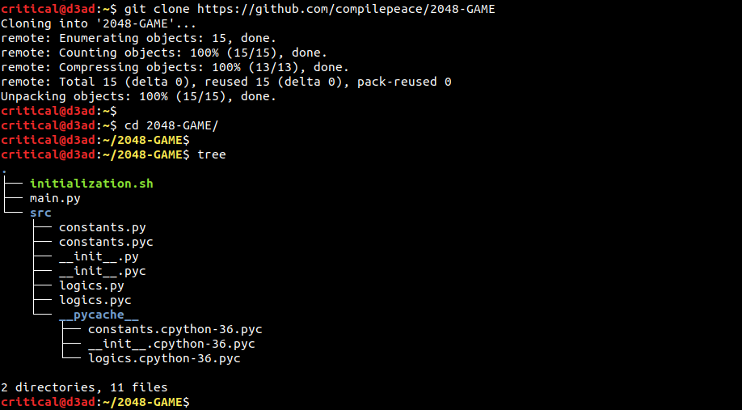
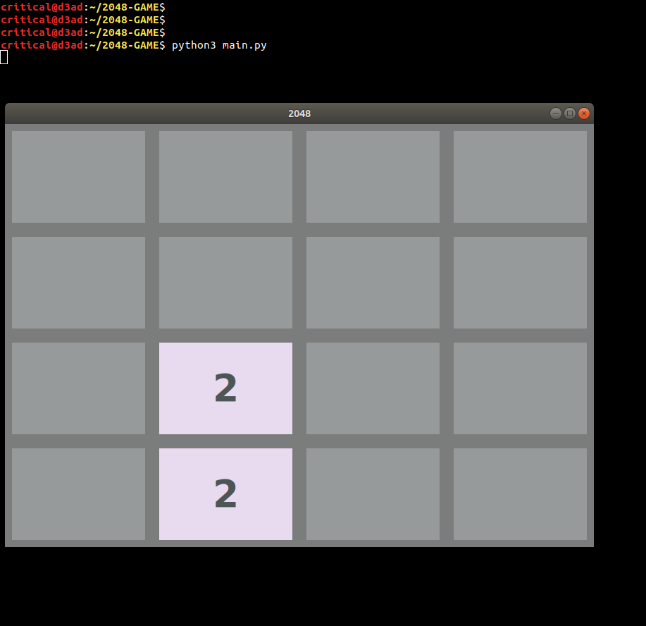
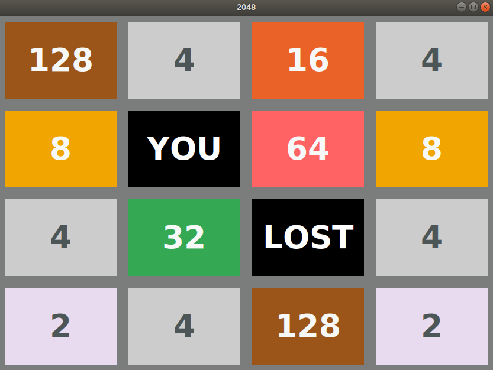

# 2048 - A Fun Challenge
2048 is a **mathematical puzzle** game. It has a 4x4 board where we can slide the tiles in upward, downward, left and right directions. 2 tiles merge when they touches each other and the player wins when a tile reaches the number **2048**. 

## Interface
Press the following keys for movement-
* **'k'** for up move
* **'j'** for down move
* **'l'** for right move 
* **'h'** for left move

## Game Time
Pay the game by following 3 simple steps.

* Clone the repository to your local system, bellow are the steps being performed on a Linux platform (Ubuntu 18.04), you can perform similar steps on windows too !

* launch the game with the bellow command (make sure you have **[tkinter]** installed on the system) 

* Play and win it like a pro (as I did below ¯\_(ツ)_/¯ )

Cheers to the creator of 2048 -> **[Gabriele Cirulli]** x_x
 

**NAME**  : Abhinav Thakur  
**EMAIL** : compilepeace@gmail.com  

[tkinter]: https://docs.python.org/3/library/tkinter.html
[Gabriele Cirulli]: https://gabrielecirulli.com/2048